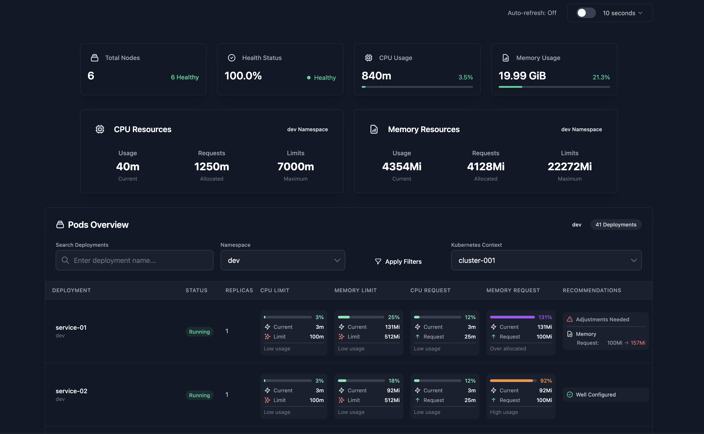

# Resource Monitoring Dashboard

Kube Request is a resource monitoring dashboard for Kubernetes clusters. It provides a unified view of cluster metrics, including CPU and memory usage. The dashboard is designed to help you quickly assess the health of your cluster, identify bottlenecks, and make informed decisions based on real-time data.


---

## Overview

The screenshot illustrates a unified panel containing:

1. **Cluster Summary**  
   - **Total Nodes**: Displays how many nodes are part of the cluster.  
   - **Health Status**: Indicates the overall health of the cluster (e.g., number of healthy nodes).  
   - **CPU Usage**: Shows total CPU usage in millicores (m) and as a percentage.  
   - **Memory Usage**: Shows total memory usage in GiB and as a percentage.

2. **CPU and Memory Metrics**  
   - **CPU Requests**: Amount of CPU requested by the pods (e.g., 40m, 1250m, 7000m).  
   - **Memory Resources**: Memory requested (e.g., 4354Mi, 4128Mi) and memory limits (e.g., 2272Mi).

3. **Pods Overview**  
   - **Namespace**: Filter to select the desired namespace.  
   - **Cluster Context**: Switch between multiple clusters or contexts.  
   - **Deployments/Pods List**: A table displaying:
     - Deployment/Pod name  
     - Status (Running, Pending, etc.)  
     - Replicas  
     - CPU Request and CPU Limit  
     - Memory Request and Memory Limit  
     - Any needed adjustments (e.g., if usage is near the limit)  
     - Additional configurations (e.g., “Pod Config Required”)

4. **Auto-refresh**  
   - Shows whether auto-refresh is On or Off, as well as the refresh interval (e.g., 30 seconds).  
   - Allows toggling automatic metric updates.

---

## Goal

- **Real-Time Monitoring**: Quickly gather insights into cluster status, especially in critical or high-availability environments.  
- **Ease of Use**: Provide a straightforward way to observe metrics without relying on complex commands or multiple separate tools.  
- **Fast Decision-Making**: Help identify CPU or memory bottlenecks, pods in error states, unhealthy nodes, and other situations that need immediate attention.

---
## Requirements
- **Kubernetes Cluster**: Ensure you have a running Kubernetes cluster.
-  **Prometheus** or **Metrics Server**: Install the Metrics Server to collect resource usage data.

## How to Use

1. **Download the Executable**  
   - Go to the [Releases](https://github.com/ArthurMaverick/kube-request/releases) page of this repository.  
   - Select the appropriate file for your operating system (e.g., `darwin_amd64.tar.gz`, `linux_amd64.tar.gz`, `windows_amd64.tar.gz`).  
   - Extract the downloaded file to get the executable.

2. **Run the Executable**  
   - Open a terminal (or command prompt) in the directory where the executable is located.  
   - Run the binary. Example for Linux/macOS:  
     ```bash
     ./kube-request
     ```
     Or on Windows:
     ```powershell
     .\kube-request.exe
      ```
3. **Access the Dashboard**  
   - Automatically opens in your default browser. If not, visit `http://localhost:8081` to view the dashboard.